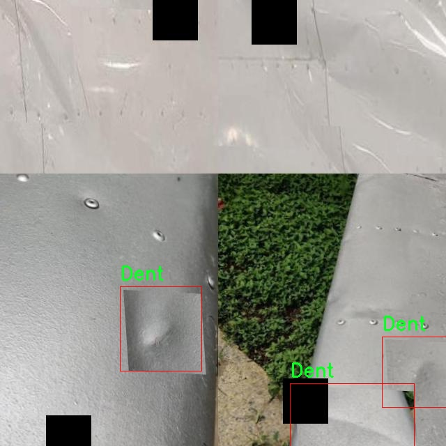

### 1.背景意义

研究背景与意义

随着航空工业的快速发展，飞机的安全性和可靠性成为了公众和行业的关注焦点。飞机在使用过程中，表面缺陷如裂纹、凹陷和缺失的紧固件等，可能对飞行安全造成严重威胁。因此，及时、准确地检测和修复这些缺陷显得尤为重要。传统的人工检测方法不仅耗时耗力，而且容易受到人为因素的影响，导致漏检或误检的情况。因此，开发一种高效、自动化的飞机表面缺陷检测系统，成为了航空维修领域亟待解决的问题。

基于深度学习的计算机视觉技术，尤其是目标检测算法的快速发展，为飞机表面缺陷检测提供了新的解决方案。YOLO（You Only Look Once）系列算法因其高效性和准确性，已广泛应用于各种目标检测任务。YOLOv11作为该系列的最新版本，具备更强的特征提取能力和实时检测性能，适合在复杂的航空环境中应用。通过对YOLOv11进行改进，可以进一步提升其在飞机表面缺陷检测中的表现。

本研究将构建一个基于改进YOLOv11的飞机表面缺陷检测系统，利用包含5813张图像的数据集进行训练和测试。该数据集涵盖了三种主要缺陷类型：裂纹、凹陷和缺失的紧固件，提供了丰富的样本以支持模型的学习与优化。通过精确的缺陷检测，不仅可以提高飞机维修的效率，还能有效降低因缺陷导致的安全隐患，提升航空运输的整体安全性。

综上所述，本研究的意义在于通过先进的计算机视觉技术，推动飞机表面缺陷检测的自动化进程，为航空维修行业提供一种可靠、高效的解决方案，进而促进航空安全的提升和行业的可持续发展。

### 2.视频效果

[2.1 视频效果](https://www.bilibili.com/video/BV1a8UdY6E66/)

### 3.图片效果


##### [项目涉及的源码数据来源链接](https://kdocs.cn/l/cszuIiCKVNis)**

注意：本项目提供训练的数据集和训练教程,由于版本持续更新,暂不提供权重文件（best.pt）,请按照6.训练教程进行训练后实现上图演示的效果。

### 4.数据集信息

##### 4.1 本项目数据集类别数＆类别名

nc: 3
names: ['Crack', 'Dent', 'Missing Fastener']


该项目为【目标检测】数据集，请在【训练教程和Web端加载模型教程（第三步）】这一步的时候按照【目标检测】部分的教程来训练

##### 4.2 本项目数据集信息介绍

本项目数据集信息介绍

本项目旨在开发一种改进的YOLOv11模型，以实现对飞机表面缺陷的高效检测。为此，我们构建了一个专门的数据集，聚焦于航空器表面可能出现的三种主要缺陷类型：裂纹（Crack）、凹陷（Dent）和缺失的紧固件（Missing Fastener）。该数据集包含丰富的图像样本，涵盖了不同角度、光照条件和背景环境下的飞机表面，以确保模型在实际应用中的鲁棒性和准确性。

在数据集的构建过程中，我们收集了来自多个航空公司和维修机构的真实飞机表面图像。这些图像经过精心标注，确保每一类缺陷都能被准确识别。裂纹类别主要包括不同长度和宽度的裂缝，凹陷类别则涵盖了从轻微凹陷到较大凹陷的多种情况，而缺失的紧固件则涉及不同部位和类型的紧固件缺失。通过这种多样化的样本选择，我们的数据集不仅反映了实际航空器维护中的常见问题，也为模型的训练提供了丰富的学习素材。

此外，为了增强模型的泛化能力，我们在数据集中引入了数据增强技术，包括旋转、缩放、翻转和颜色调整等。这些技术的应用旨在模拟不同的拍摄条件和环境变化，使得模型在面对新数据时能够保持较高的检测性能。通过这样的数据集构建和处理，我们期望能显著提升YOLOv11在飞机表面缺陷检测任务中的表现，从而为航空安全提供更为可靠的技术支持。





### 5.全套项目环境部署视频教程（零基础手把手教学）

[5.1 所需软件PyCharm和Anaconda安装教程（第一步）](https://www.bilibili.com/video/BV1BoC1YCEKi/?spm_id_from=333.999.0.0&vd_source=bc9aec86d164b67a7004b996143742dc)


[5.2 安装Python虚拟环境创建和依赖库安装视频教程（第二步）](https://www.bilibili.com/video/BV1ZoC1YCEBw?spm_id_from=333.788.videopod.sections&vd_source=bc9aec86d164b67a7004b996143742dc)

### 6.改进YOLOv11训练教程和Web_UI前端加载模型教程（零基础手把手教学）

[6.1 改进YOLOv11训练教程和Web_UI前端加载模型教程（第三步）](https://www.bilibili.com/video/BV1BoC1YCEhR?spm_id_from=333.788.videopod.sections&vd_source=bc9aec86d164b67a7004b996143742dc)


按照上面的训练视频教程链接加载项目提供的数据集，运行train.py即可开始训练



     Epoch   gpu_mem       box       obj       cls    labels  img_size
     1/200     20.8G   0.01576   0.01955  0.007536        22      1280: 100%|██████████| 849/849 [14:42<00:00,  1.04s/it]
               Class     Images     Labels          P          R     mAP@.5 mAP@.5:.95: 100%|██████████| 213/213 [01:14<00:00,  2.87it/s]
                 all       3395      17314      0.994      0.957      0.0957      0.0843

     Epoch   gpu_mem       box       obj       cls    labels  img_size
     2/200     20.8G   0.01578   0.01923  0.007006        22      1280: 100%|██████████| 849/849 [14:44<00:00,  1.04s/it]
               Class     Images     Labels          P          R     mAP@.5 mAP@.5:.95: 100%|██████████| 213/213 [01:12<00:00,  2.95it/s]
                 all       3395      17314      0.996      0.956      0.0957      0.0845

     Epoch   gpu_mem       box       obj       cls    labels  img_size
     3/200     20.8G   0.01561    0.0191  0.006895        27      1280: 100%|██████████| 849/849 [10:56<00:00,  1.29it/s]
               Class     Images     Labels          P          R     mAP@.5 mAP@.5:.95: 100%|███████   | 187/213 [00:52<00:00,  4.04it/s]
                 all       3395      17314      0.996      0.957      0.0957      0.0845


###### [项目数据集下载链接](https://kdocs.cn/l/cszuIiCKVNis)

### 7.原始YOLOv11算法讲解


YOLO11 是 Ultralytics YOLO 系列的最新版本，结合了尖端的准确性、速度和效率，用于目标检测、分割、分类、定向边界框和姿态估计。与
YOLOv8 相比，它具有更少的参数和更好的结果，不难预见，YOLO11 在边缘设备上更高效、更快，将频繁出现在计算机视觉领域的最先进技术（SOTA）中。


**主要特点**

  * **增强的特征提取：**YOLO11 使用改进的主干和颈部架构来增强特征提取，以实现更精确的目标检测和复杂任务的性能。

  * **针对效率和速度优化：**精细的架构设计和优化的训练流程在保持准确性和性能之间最佳平衡的同时，提供更快的处理速度。

  * **更少的参数，更高的准确度：**YOLO11m 在 COCO 数据集上实现了比 YOLOv8m 更高的 mAP，参数减少了 22%，提高了计算效率，同时不牺牲准确度。

  * **跨环境的适应性：**YOLO11 可以无缝部署在边缘设备、云平台和配备 NVIDIA GPU 的系统上，确保最大的灵活性。

  * **支持广泛的任务范围：**YOLO11 支持各种计算机视觉任务，如目标检测、实例分割、图像分类、姿态估计和定向目标检测（OBB）。


### 8.200+种全套改进YOLOV11创新点原理讲解

#### 8.1 200+种全套改进YOLOV11创新点原理讲解大全

由于篇幅限制，每个创新点的具体原理讲解就不全部展开，具体见下列网址中的改进模块对应项目的技术原理博客网址【Blog】（创新点均为模块化搭建，原理适配YOLOv5~YOLOv11等各种版本）

[改进模块技术原理博客【Blog】网址链接](https://gitee.com/qunmasj/good)


#### 8.2 精选部分改进YOLOV11创新点原理讲解

###### 这里节选部分改进创新点展开原理讲解(完整的改进原理见上图和[改进模块技术原理博客链接](https://gitee.com/qunmasj/good)【如果此小节的图加载失败可以通过CSDN或者Github搜索该博客的标题访问原始博客，原始博客图片显示正常】
### 深度学习基础
卷积神经网络通过使用具有共享参数的卷积运算显著降低了模型的计算开销和复杂性。在LeNet、AlexNet和VGG等经典网络的驱动下，卷积神经网络现在已经建立了一个完整的系统，并在深度学习领域形成了先进的卷积神经网络模型。

感受野注意力卷积RFCBAMConv的作者在仔细研究了卷积运算之后获得了灵感。对于分类、目标检测和语义分割任务，一方面，图像中不同位置的对象的形状、大小、颜色和分布是可变的。在卷积操作期间，卷积核在每个感受野中使用相同的参数来提取信息，而不考虑来自不同位置的差分信息。这限制了网络的性能，这已经在最近的许多工作中得到了证实。

另一方面，卷积运算没有考虑每个特征的重要性，这进一步影响了提取特征的有效性，并最终限制了模型的性能。此外，注意力机制允许模型专注于重要特征，这可以增强特征提取的优势和卷积神经网络捕获详细特征信息的能力。因此，注意力机制在深度学习中得到了广泛的应用，并成功地应用于各个领域。

通过研究卷积运算的内在缺陷和注意力机制的特点，作者认为现有的空间注意力机制从本质上解决了卷积运算的参数共享问题，但仍局限于对空间特征的认知。对于较大的卷积核，现有的空间注意力机制并没有完全解决共享参数的问题。此外，他们无法强调感受野中每个特征的重要性，例如现有的卷积块注意力模块（CBAM）和 Coordinate注意力（CA）。

因此，[参考该博客提出了一种新的感受野注意力机制（RFA）](https://qunmasj.com)，它完全解决了卷积核共享参数的问题，并充分考虑了感受野中每个特征的重要性。通过RFA设计的卷积运算（RFAConv）是一种新的卷积运算，可以取代现有神经网络中的标准卷积运算。RFAConv通过添加一些参数和计算开销来提高网络性能。

大量关于Imagnet-1k、MS COCO和VOC的实验已经证明了RFAConv的有效性。作为一种由注意力构建的新型卷积运算，它超过了由CAM、CBAM和CA构建的卷积运算（CAMConv、CBAMConv、CAConv）以及标准卷积运算。

此外，为了解决现有方法提取感受野特征速度慢的问题，提出了一种轻量级操作。在构建RFAConv的过程中，再次设计了CA和CBAM的升级版本，并进行了相关实验。作者认为当前的空间注意力机制应该将注意力放在感受野空间特征上，以促进当前空间注意力机制的发展，并再次增强卷积神经网络架构的优势。


### 卷积神经网络架构
出色的神经网络架构可以提高不同任务的性能。卷积运算作为卷积神经网络的一种基本运算，推动了人工智能的发展，并为车辆检测、无人机图像、医学等先进的网络模型做出了贡献。He等人认为随着网络深度的增加，该模型将变得难以训练并产生退化现象，因此他们提出了残差连接来创新卷积神经网络架构的设计。Huang等人通过重用特征来解决网络梯度消失问题，增强了特征信息，他们再次创新了卷积神经网络架构。

通过对卷积运算的详细研究，Dai等人认为，具有固定采样位置的卷积运算在一定程度上限制了网络的性能，因此提出了Deformable Conv，通过学习偏移来改变卷积核的采样位置。在Deformable Conv的基础上，再次提出了Deformable Conv V2和Deformable Conv V3，以提高卷积网络的性能。

Zhang等人注意到，组卷积可以减少模型的参数数量和计算开销。然而，少于组内信息的交互将影响最终的网络性能。1×1的卷积可以与信息相互作用。然而，这将带来更多的参数和计算开销，因此他们提出了无参数的“通道Shuffle”操作来与组之间的信息交互。

Ma等人通过实验得出结论，对于参数较少的模型，推理速度不一定更快，对于计算量较小的模型，推理也不一定更快。经过仔细研究提出了Shufflenet V2。

YOLO将输入图像划分为网格，以预测对象的位置和类别。经过不断的研究，已经提出了8个版本的基于YOLO的目标检测器，如YOLOv11、YOLOv11、YOLOv11等。上述卷积神经网络架构已经取得了巨大的成功。然而，它们并没有解决提取特征过程中的参数共享问题。本文的工作从注意力机制开始，从一个新的角度解决卷积参数共享问题。

### 注意力机制
注意力机制被用作一种提高网络模型性能的技术，使其能够专注于关键特性。注意力机制理论已经在深度学习中建立了一个完整而成熟的体系。Hu等人提出了一种Squeeze-and-Excitation（SE）块，通过压缩特征来聚合全局通道信息，从而获得与每个通道对应的权重。Wang等人认为，当SE与信息交互时，单个通道和权重之间的对应关系是间接的，因此设计了高效通道注Efficient Channel Attention力（ECA），并用自适应kernel大小的一维卷积取代了SE中的全连接（FC）层。Woo等人提出了卷积块注意力模块（CBAM），它结合了通道注意力和空间注意力。作为一个即插即用模块，它可以嵌入卷积神经网络中，以提高网络性能。

尽管SE和CBAM已经提高了网络的性能。Hou等人仍然发现压缩特征在SE和CBAM中丢失了太多信息。因此，他们提出了轻量级Coordinate注意力（CA）来解决SE和CBAM中的问题。Fu等人计了一个空间注意力模块和通道注意力模块，用于扩展全卷积网络（FCN），分别对空间维度和通道维度的语义相关性进行建模。Zhang等人在通道上生成不同尺度的特征图，以建立更有效的通道注意力机制。

本文从一个新的角度解决了标准卷积运算的参数共享问题。这就是将注意力机制结合起来构造卷积运算。尽管目前的注意力机制已经获得了良好的性能，但它们仍然没有关注感受野的空间特征。因此，设计了具有非共享参数的RFA卷积运算，以提高网络的性能。


#### 回顾标准卷积
以标准卷积运算为基础构建卷积神经网络，通过共享参数的滑动窗口提取特征信息，解决了全连接层构建的神经网络的固有问题（即参数数量大、计算开销高）。

设表示输入特征图，其中、和分别表示特征图的通道数、高度和宽度。为了能够清楚地展示卷积核提取特征信息的过程，以为例。提取每个感受野slider的特征信息的卷积运算可以表示如下：


这里，表示在每次卷积slider操作之后获得的值，表示在每个slider内的相应位置处的像素值。表示卷积核，表示卷积核中的参数数量，表示感受野slider的总数。

可以看出，每个slider内相同位置的特征共享相同的参数。因此，标准的卷积运算无法感知不同位置带来的差异信息，这在一定程度上限制了卷积神经网络的性能。

#### 回顾空间注意力
目前，空间注意力机制使用通过学习获得的注意力图来突出每个特征的重要性。与上一节类似，以为例。突出关键特征的空间注意力机制可以简单地表达如下：


这里，表示在加权运算之后获得的值。和分别表示输入特征图和学习注意力图在不同位置的值，是输入特征图的高度和宽度的乘积，表示像素值的总数。一般来说，整个过程可以简单地表示在图1中。


#### 空间注意力与标准卷积
众所周知，将注意力机制引入卷积神经网络可以提高网络的性能。通过标准的卷积运算和对现有空间注意力机制的仔细分析。作者认为空间注意力机制本质上解决了卷积神经网络的固有缺点，即共享参数的问题。

目前，该模型最常见的卷积核大小为1×1和3×3。引入空间注意力机制后用于提取特征的卷积操作是1×1或3×3卷积操作。这个过程可以直观地显示出来。空间注意力机制被插入到1×1卷积运算的前面。通过注意力图对输入特征图进行加权运算（Re-weight“×”），最后通过1×1卷积运算提取感受野的slider特征信息。

整个过程可以简单地表示如下：


 

这里，卷积核仅表示一个参数值。如果将的值作为一个新的卷积核参数，那么有趣的是，通过1×1卷积运算提取特征时的参数共享问题得到了解决。然而，空间注意力机制的传说到此结束。当空间注意力机制被插入到3×3卷积运算的前面时。具体情况如下：


如上所述，如果取的值。作为一种新的卷积核参数，上述方程完全解决了大规模卷积核的参数共享问题。然而，最重要的一点是，卷积核在每个感受野slider中提取将共享部分特征的特征。换句话说，在每个感受野slider内都会有重叠。

经过仔细分析发现，，…，空间注意力图的权重在每个slider内共享。因此，空间注意机制不能解决大规模卷积核共享参数的问题，因为它们不注意感受野的空间特征。在这种情况下，空间注意力机制是有限的。
#### 创新空间注意力与标准卷积
RFA是为了解决空间注意力机制问题而提出的，创新了空间注意力。使用与RFA相同的思想，一系列空间注意力机制可以再次提高性能。RFA设计的卷积运算可以被视为一种轻量级的即插即用模块，以取代标准卷积，从而提高卷积神经网络的性能。因此，作者认为空间注意力机制和标准卷积在未来将有一个新的春天。

感受野的空间特征：

现在给出感受野空间特征的定义。它是专门为卷积核设计的，并根据kernel大小动态生成，如图2所示，以3×3卷积核为例。


在图2中，“空间特征”表示原始特征图，等于空间特征。“感受野空间特征”表示变换后的特征，该特征由每个感受野slider滑块组成，并且不重叠。也就是说，“感受野空间特征”中的每个3×3大小的slider表示提取原始3×3卷积特征时所有感觉野slider的特征。

#### 感受野注意力卷积(RFA):

关于感受野空间特征，该博客的作者提出了感受野注意（RFA），它不仅强调了感受野slider内各种特征的重要性，而且还关注感受野空间特性，以彻底解决卷积核参数共享的问题。感受野空间特征是根据卷积核的大小动态生成的，因此，RFA是卷积的固定组合，不能脱离卷积运算的帮助，卷积运算同时依赖RFA来提高性能。

因此，作者提出了感受野注意力卷积（RFAConv）。具有3×3大小卷积核的RFAConv的总体结构如图3所示。


目前，提取感受野特征最常用的方法速度较慢，因此经过不断探索提出了一种快速的方法，通过分组卷积来取代原来的方法。

具体来说，根据感受野大小，使用相应的组卷积大小来动态生成展开特征。尽管与原始的无参数方法（如Pytorch提供的nn.Unfld()）相比，该方法添加了一些参数，但速度要快得多。

注意：正如在上一节中提到的，当原始的3×3卷积核提取特征时，感受野空间特征中的每个3×3大小的窗口表示所有感受野滑块的特征。但在快速分组卷积提取感受野特征后，由于原始方法太慢，它们会被映射到新的特征中。

最近的一些工作已经证明信息交互可以提高网络性能。类似地，对于RFAConv，与感受野特征信息交互以学习注意力图可以提高网络性能，但与每个感受野特征交互将带来额外的计算开销。为了确保少量的计算开销和参数数量，通过探索使用AvgPool池化每个感受野特征的全局信息，然后通过1×1组卷积运算与信息交互。最后，softmax用于强调感受野特征中每个特征的重要性。通常，RFA的计算可以表示为：


表示分组卷积，表示卷积核的大小，代表规范化，表示输入特征图，是通过将注意力图与变换的感受野空间特征相乘而获得的。

与CBAM和CA不同，RFA可以为每个感受野特征生成注意力图。标准卷积受到卷积神经网络性能的限制，因为共享参数的卷积运算对位置带来的差异信息不敏感。RFA完全可以解决这个问题，具体细节如下：


由于RFA获得的特征图是“调整形状”后不重叠的感受野空间特征，因此通过池化每个感受野滑块的特征信息来学习学习的注意力图。换句话说，RFA学习的注意力图不再在每个感受野slider内共享，并且是有效的。这完全解决了现有的CA和CBAM对大尺寸kernel的注意力机制中的参数共享问题。

同时，RFA给标准卷积核带来了相当大的好处，但调整形状后，特征的高度和宽度是k倍，需要进行k×k的stride卷积运算，才能提取特征信息。RFAConv创新了标准卷积运算。

此外，空间注意力机制将得到升级，因为作者认为现有的空间注意力机制应该专注于感受野空间特征，以提高网络的性能。众所周知，基于自注意力机制的网络模型取得了巨大的成功，因为它解决了卷积参数共享的问题，并对远程信息进行了建模，但基于自注意力机理的方法给模型带来了巨大的计算开销和复杂性。作者认为通过将一些现有空间注意力机制的注意力放在感受野空间特征中，它以轻量级的方式解决了自注意力机制的问题。

答案如下：

将关注感受野空间特征的空间注意力与卷积相匹配，完全解决了卷积参数共享的问题；

当前的空间注意力机制本身具有考虑远距离信息的特点，它们通过全局平均池化或全局最大池化来获得全局信息，这在一定程度上考虑了远距离信息。


为此，作者设计了一种新的CBAM和CA，称为RFACBAM和RFACA，它专注于感受野的空间特征。与RFA类似，使用stride为k的k×k的最终卷积运算来提取特征信息，具体结构如图4和图5所示，将这2种新的卷积方法称为RFCBAMConv和RFCAConv。比较原始的CBAM，使用SE注意力来代替RFCBAM中的CAM。因为这样可以减少计算开销。


此外，在RFCBAM中，通道和空间注意力不是在单独的步骤中执行的，因为通道和空间注意力是同时加权的，从而允许在每个通道上获得的注意力图是不同的。


### 9.系统功能展示

图9.1.系统支持检测结果表格显示

  图9.2.系统支持置信度和IOU阈值手动调节

  图9.3.系统支持自定义加载权重文件best.pt(需要你通过步骤5中训练获得)

  图9.4.系统支持摄像头实时识别

  图9.5.系统支持图片识别

  图9.6.系统支持视频识别

  图9.7.系统支持识别结果文件自动保存

  图9.8.系统支持Excel导出检测结果数据


### 10. YOLOv11核心改进源码讲解

#### 10.1 mamba_yolo.py

以下是经过精简和注释的核心代码部分，主要保留了关键的类和函数，去掉了冗余的部分，并对每个重要部分进行了详细的中文注释。

```python
import torch
import torch.nn as nn
from einops import rearrange

# 定义二维层归一化
class LayerNorm2d(nn.Module):
    def __init__(self, normalized_shape, eps=1e-6, elementwise_affine=True):
        super().__init__()
        self.norm = nn.LayerNorm(normalized_shape, eps, elementwise_affine)

    def forward(self, x):
        # 调整张量形状以适应LayerNorm
        x = rearrange(x, 'b c h w -> b h w c').contiguous()
        x = self.norm(x)
        x = rearrange(x, 'b h w c -> b c h w').contiguous()
        return x

# 自动计算填充
def autopad(k, p=None, d=1):
    """自动填充以保持输出形状相同"""
    if d > 1:
        k = d * (k - 1) + 1 if isinstance(k, int) else [d * (x - 1) + 1 for x in k]
    if p is None:
        p = k // 2 if isinstance(k, int) else [x // 2 for x in k]
    return p

# 交叉扫描功能
class CrossScan(torch.autograd.Function):
    @staticmethod
    def forward(ctx, x: torch.Tensor):
        B, C, H, W = x.shape
        ctx.shape = (B, C, H, W)
        xs = x.new_empty((B, 4, C, H * W))
        xs[:, 0] = x.flatten(2, 3)  # 原始张量展平
        xs[:, 1] = x.transpose(dim0=2, dim1=3).flatten(2, 3)  # 转置后展平
        xs[:, 2:4] = torch.flip(xs[:, 0:2], dims=[-1])  # 翻转
        return xs

    @staticmethod
    def backward(ctx, ys: torch.Tensor):
        B, C, H, W = ctx.shape
        L = H * W
        ys = ys[:, 0:2] + ys[:, 2:4].flip(dims=[-1]).view(B, 2, -1, L)
        y = ys[:, 0] + ys[:, 1].view(B, -1, W, H).transpose(dim0=2, dim1=3).contiguous().view(B, -1, L)
        return y.view(B, -1, H, W)

# 选择性扫描核心
class SelectiveScanCore(torch.autograd.Function):
    @staticmethod
    @torch.cuda.amp.custom_fwd
    def forward(ctx, u, delta, A, B, C, D=None, delta_bias=None, delta_softplus=False, nrows=1, backnrows=1):
        # 确保输入张量是连续的
        if u.stride(-1) != 1:
            u = u.contiguous()
        if delta.stride(-1) != 1:
            delta = delta.contiguous()
        if D is not None and D.stride(-1) != 1:
            D = D.contiguous()
        if B.stride(-1) != 1:
            B = B.contiguous()
        if C.stride(-1) != 1:
            C = C.contiguous()
        
        # 处理维度
        if B.dim() == 3:
            B = B.unsqueeze(dim=1)
            ctx.squeeze_B = True
        if C.dim() == 3:
            C = C.unsqueeze(dim=1)
            ctx.squeeze_C = True
        
        ctx.delta_softplus = delta_softplus
        ctx.backnrows = backnrows
        
        # 调用CUDA核心进行前向计算
        out, x, *rest = selective_scan_cuda_core.fwd(u, delta, A, B, C, D, delta_bias, delta_softplus, 1)
        ctx.save_for_backward(u, delta, A, B, C, D, delta_bias, x)
        return out

    @staticmethod
    @torch.cuda.amp.custom_bwd
    def backward(ctx, dout, *args):
        u, delta, A, B, C, D, delta_bias, x = ctx.saved_tensors
        if dout.stride(-1) != 1:
            dout = dout.contiguous()
        du, ddelta, dA, dB, dC, dD, ddelta_bias, *rest = selective_scan_cuda_core.bwd(
            u, delta, A, B, C, D, delta_bias, dout, x, ctx.delta_softplus, 1
        )
        return (du, ddelta, dA, dB, dC, dD, ddelta_bias, None, None, None, None)

# 选择性扫描函数
def cross_selective_scan(x: torch.Tensor, x_proj_weight: torch.Tensor, dt_projs_weight: torch.Tensor, A_logs: torch.Tensor, Ds: torch.Tensor, out_norm: torch.nn.Module = None):
    B, D, H, W = x.shape
    L = H * W

    # 进行交叉扫描
    xs = CrossScan.apply(x)

    # 计算投影
    x_dbl = torch.einsum("b k d l, k c d -> b k c l", xs, x_proj_weight)
    dts, Bs, Cs = torch.split(x_dbl, [R, N, N], dim=2)
    dts = torch.einsum("b k r l, k d r -> b k d l", dts, dt_projs_weight)
    
    # HiPPO矩阵
    As = -torch.exp(A_logs.to(torch.float))
    delta_bias = dt_projs_bias.view(-1).to(torch.float)

    # 选择性扫描
    ys: torch.Tensor = SelectiveScan.apply(xs, dts, As, Bs, Cs, Ds, delta_bias)
    y: torch.Tensor = CrossMerge.apply(ys)

    # 归一化输出
    if out_norm is not None:
        y = out_norm(y.view(B, -1, H, W)).view(B, H, W, -1)

    return y

# 简单的Stem模块
class SimpleStem(nn.Module):
    def __init__(self, inp, embed_dim, ks=3):
        super().__init__()
        self.hidden_dims = embed_dim // 2
        self.conv = nn.Sequential(
            nn.Conv2d(inp, self.hidden_dims, kernel_size=ks, stride=2, padding=autopad(ks, d=1), bias=False),
            nn.BatchNorm2d(self.hidden_dims),
            nn.GELU(),
            nn.Conv2d(self.hidden_dims, embed_dim, kernel_size=ks, stride=2, padding=autopad(ks, d=1), bias=False),
            nn.BatchNorm2d(embed_dim),
            nn.SiLU(),
        )

    def forward(self, x):
        return self.conv(x)

# VSSBlock_YOLO模块
class VSSBlock_YOLO(nn.Module):
    def __init__(self, in_channels: int, hidden_dim: int, drop_path: float):
        super().__init__()
        self.proj_conv = nn.Sequential(
            nn.Conv2d(in_channels, hidden_dim, kernel_size=1, stride=1, padding=0, bias=True),
            nn.BatchNorm2d(hidden_dim),
            nn.SiLU()
        )
        self.drop_path = DropPath(drop_path)

    def forward(self, input: torch.Tensor):
        input = self.proj_conv(input)
        # 进行前向计算
        return self.drop_path(input)

# 其他模块如SS2D、XSSBlock等可以根据需要添加
```

### 代码说明：
1. **LayerNorm2d**: 实现了二维层归一化，适用于图像数据。
2. **autopad**: 自动计算填充，以保持卷积输出的形状与输入相同。
3. **CrossScan**: 实现了交叉扫描操作，主要用于处理图像数据的特征。
4. **SelectiveScanCore**: 选择性扫描的核心功能，包含前向和反向传播的实现。
5. **cross_selective_scan**: 选择性扫描的高层接口，整合了多个步骤。
6. **SimpleStem**: 简单的卷积模块，用于特征提取。
7. **VSSBlock_YOLO**: YOLO模型中的一个块，负责特征的投影和处理。

以上是核心代码的提炼和注释，去掉了不必要的部分，使其更加简洁明了。

该文件 `mamba_yolo.py` 是一个用于构建 YOLO（You Only Look Once）目标检测模型的 PyTorch 实现。代码中包含多个类和函数，主要用于实现模型的不同组件和功能。以下是对代码的逐部分分析和说明。

首先，文件导入了一些必要的库，包括 `torch`、`math`、`functools` 和 `torch.nn` 等。接着，定义了一些自定义的层和功能，如 `LayerNorm2d`，它是一个二维的层归一化模块，适用于图像数据。该模块在前向传播中会调整输入的维度，以适应 `nn.LayerNorm` 的要求。

接下来，定义了 `autopad` 函数，用于自动计算卷积操作的填充，以确保输出的形状与输入相同。然后，定义了 `CrossScan` 和 `CrossMerge` 类，这两个类实现了交叉扫描和交叉合并的功能，主要用于在特征图上进行操作，以便提取更丰富的特征。

`SelectiveScanCore` 类实现了选择性扫描的核心功能，它使用了 CUDA 加速的自定义前向和反向传播方法，以提高计算效率。该类的前向方法会根据输入的张量执行选择性扫描操作，并返回结果。

`cross_selective_scan` 函数是一个辅助函数，封装了选择性扫描的调用，处理输入的多个参数，并返回处理后的输出。它涉及到多个参数的计算和变换，确保最终输出的形状和数据类型符合要求。

接下来是 `SS2D` 类，它是一个主要的模块，负责处理输入的特征图并进行一系列的变换和操作。该类包含多个卷积层、线性层和激活函数，并且支持不同的前向传播类型。它的设计考虑了多种参数配置，以便在不同的场景下使用。

`RGBlock` 和 `LSBlock` 类是用于构建网络的基本块，分别实现了不同的前向传播逻辑，包括卷积、激活和残差连接等。`XSSBlock` 类则是一个更复杂的模块，结合了多个子模块，进行特征的提取和变换。

`VSSBlock_YOLO` 类是 YOLO 模型的核心块之一，结合了选择性扫描和其他操作，以实现高效的特征提取。该类的前向方法实现了输入特征的处理和最终输出的生成。

`SimpleStem` 类是模型的输入处理模块，负责将输入图像转换为适合后续处理的特征图。它通过一系列卷积和归一化操作来实现。

最后，`VisionClueMerge` 类用于将不同来源的特征图合并，以便于后续的处理和分类任务。

整体来看，该文件实现了一个复杂的目标检测模型的基础架构，结合了多种深度学习技术和模块，旨在提高目标检测的精度和效率。代码中使用了大量的自定义层和操作，以适应特定的任务需求，同时也提供了灵活的参数配置，以便于在不同的应用场景中进行调整和优化。

#### 10.2 FreqFusion.py

以下是代码中最核心的部分，并附上详细的中文注释：

```python
import torch
import torch.nn as nn
import torch.nn.functional as F

class FreqFusion(nn.Module):
    def __init__(self, channels, scale_factor=1, lowpass_kernel=5, highpass_kernel=3, **kwargs):
        super().__init__()
        hr_channels, lr_channels = channels
        self.scale_factor = scale_factor
        self.lowpass_kernel = lowpass_kernel
        self.highpass_kernel = highpass_kernel
        
        # 压缩高分辨率和低分辨率特征通道
        self.compressed_channels = (hr_channels + lr_channels) // 8
        self.hr_channel_compressor = nn.Conv2d(hr_channels, self.compressed_channels, 1)
        self.lr_channel_compressor = nn.Conv2d(lr_channels, self.compressed_channels, 1)

        # 低通滤波器生成器
        self.content_encoder = nn.Conv2d(
            self.compressed_channels,
            lowpass_kernel ** 2,
            kernel_size=3,
            padding=1
        )

        # 高通滤波器生成器
        self.content_encoder2 = nn.Conv2d(
            self.compressed_channels,
            highpass_kernel ** 2,
            kernel_size=3,
            padding=1
        )

    def kernel_normalizer(self, mask, kernel):
        """
        对生成的掩码进行归一化处理，使其和为1。
        """
        mask = F.softmax(mask, dim=1)  # 对掩码进行softmax处理
        mask = mask.view(mask.size(0), -1, kernel, kernel)  # 调整形状
        mask /= mask.sum(dim=(-1, -2), keepdims=True)  # 归一化
        return mask

    def forward(self, x):
        """
        前向传播函数，接收高分辨率和低分辨率特征，进行频率感知特征融合。
        """
        hr_feat, lr_feat = x  # 拆分输入特征
        compressed_hr_feat = self.hr_channel_compressor(hr_feat)  # 压缩高分辨率特征
        compressed_lr_feat = self.lr_channel_compressor(lr_feat)  # 压缩低分辨率特征

        # 生成低通掩码
        mask_lr = self.content_encoder(compressed_hr_feat) + self.content_encoder(compressed_lr_feat)
        mask_lr = self.kernel_normalizer(mask_lr, self.lowpass_kernel)  # 归一化低通掩码

        # 生成高通掩码
        mask_hr = self.content_encoder2(compressed_hr_feat) + self.content_encoder2(compressed_lr_feat)
        mask_hr = self.kernel_normalizer(mask_hr, self.highpass_kernel)  # 归一化高通掩码

        # 使用掩码对特征进行处理
        lr_feat = F.conv2d(lr_feat, mask_lr)  # 低分辨率特征处理
        hr_feat = F.conv2d(hr_feat, mask_hr)  # 高分辨率特征处理

        return hr_feat + lr_feat  # 返回融合后的特征
```

### 代码注释说明：

1. **导入必要的库**：导入PyTorch库及其相关模块，用于构建神经网络和进行张量操作。

2. **FreqFusion类**：这是一个继承自`nn.Module`的类，主要用于实现频率感知特征融合。

3. **初始化函数`__init__`**：
   - 接收通道数、缩放因子、低通和高通滤波器的核大小等参数。
   - 定义高分辨率和低分辨率特征的压缩卷积层。
   - 定义低通和高通滤波器的生成器。

4. **`kernel_normalizer`函数**：对生成的掩码进行归一化处理，使得掩码的和为1，以便在后续的卷积操作中使用。

5. **`forward`函数**：实现前向传播逻辑，接收高分辨率和低分辨率特征，进行特征压缩、掩码生成和特征融合。返回融合后的特征。

以上是核心部分的代码和详细注释，帮助理解频率感知特征融合的实现过程。

这个程序文件 `FreqFusion.py` 实现了一个名为 `FreqFusion` 的深度学习模块，主要用于图像的密集预测任务。该模块关注于频率感知特征融合，结合了高频和低频特征以提高图像重建的质量。

首先，文件导入了必要的库，包括 PyTorch 和一些用于卷积操作的函数。接着，定义了一些初始化函数，例如 `normal_init` 和 `constant_init`，用于对神经网络层的权重和偏置进行初始化。这些初始化方法有助于提高模型的收敛速度和性能。

`resize` 函数用于调整输入张量的大小，使用插值方法来处理图像的缩放，确保在调整大小时不会引发警告。`hamming2D` 函数生成二维 Hamming 窗，通常用于信号处理中的窗口函数。

接下来，定义了 `FreqFusion` 类，该类继承自 `nn.Module`。在初始化方法中，类的构造函数接收多个参数，如通道数、缩放因子、低通和高通滤波器的核大小等。类内部创建了多个卷积层，用于对高分辨率和低分辨率特征进行压缩和编码。根据传入的参数，模块可以选择使用高通和低通滤波器，进行特征的融合和上采样。

在 `init_weights` 方法中，模型的权重被初始化，确保卷积层的权重遵循一定的分布。`kernel_normalizer` 方法用于对生成的掩码进行归一化处理，以便后续的卷积操作。

`forward` 方法是模块的前向传播函数，接收高分辨率和低分辨率的特征图。根据是否使用检查点机制，选择直接调用 `_forward` 方法进行计算。`_forward` 方法实现了特征的融合逻辑，包括对高频和低频特征的处理、掩码的生成以及最终特征的合成。

在 `LocalSimGuidedSampler` 类中，定义了一个用于生成偏移量的模块，结合了局部相似性引导的采样机制。该类实现了对输入特征的相似性计算，并根据计算结果生成采样偏移。

最后，`compute_similarity` 函数用于计算输入张量中每个点与其周围点的余弦相似度，这对于生成特征的偏移量非常重要。

总体而言，`FreqFusion.py` 文件实现了一个复杂的图像处理模块，利用频率特征的融合来提升图像重建的效果，适用于图像超分辨率等任务。该模块通过灵活的参数设置和特征处理策略，能够适应不同的应用场景。

#### 10.3 kan_conv.py

以下是代码中最核心的部分，并附上详细的中文注释：

```python
import torch
import torch.nn as nn

class KANConvNDLayer(nn.Module):
    def __init__(self, conv_class, norm_class, input_dim, output_dim, spline_order, kernel_size,
                 groups=1, padding=0, stride=1, dilation=1,
                 ndim: int = 2, grid_size=5, base_activation=nn.GELU, grid_range=[-1, 1], dropout=0.0):
        super(KANConvNDLayer, self).__init__()
        
        # 初始化参数
        self.inputdim = input_dim  # 输入维度
        self.outdim = output_dim    # 输出维度
        self.spline_order = spline_order  # 样条曲线的阶数
        self.kernel_size = kernel_size  # 卷积核大小
        self.padding = padding  # 填充
        self.stride = stride  # 步幅
        self.dilation = dilation  # 膨胀率
        self.groups = groups  # 分组数
        self.ndim = ndim  # 维度
        self.grid_size = grid_size  # 网格大小
        self.base_activation = base_activation()  # 基础激活函数
        self.grid_range = grid_range  # 网格范围

        # 初始化dropout层
        self.dropout = None
        if dropout > 0:
            if ndim == 1:
                self.dropout = nn.Dropout1d(p=dropout)
            elif ndim == 2:
                self.dropout = nn.Dropout2d(p=dropout)
            elif ndim == 3:
                self.dropout = nn.Dropout3d(p=dropout)

        # 检查分组数和输入输出维度的有效性
        if groups <= 0:
            raise ValueError('groups must be a positive integer')
        if input_dim % groups != 0:
            raise ValueError('input_dim must be divisible by groups')
        if output_dim % groups != 0:
            raise ValueError('output_dim must be divisible by groups')

        # 初始化基础卷积层
        self.base_conv = nn.ModuleList([conv_class(input_dim // groups,
                                                   output_dim // groups,
                                                   kernel_size,
                                                   stride,
                                                   padding,
                                                   dilation,
                                                   groups=1,
                                                   bias=False) for _ in range(groups)])

        # 初始化样条卷积层
        self.spline_conv = nn.ModuleList([conv_class((grid_size + spline_order) * input_dim // groups,
                                                     output_dim // groups,
                                                     kernel_size,
                                                     stride,
                                                     padding,
                                                     dilation,
                                                     groups=1,
                                                     bias=False) for _ in range(groups)])

        # 初始化归一化层
        self.layer_norm = nn.ModuleList([norm_class(output_dim // groups) for _ in range(groups)])

        # 初始化PReLU激活函数
        self.prelus = nn.ModuleList([nn.PReLU() for _ in range(groups)])

        # 创建网格
        h = (self.grid_range[1] - self.grid_range[0]) / grid_size
        self.grid = torch.linspace(
            self.grid_range[0] - h * spline_order,
            self.grid_range[1] + h * spline_order,
            grid_size + 2 * spline_order + 1,
            dtype=torch.float32
        )

        # 使用Kaiming均匀分布初始化卷积层权重
        for conv_layer in self.base_conv:
            nn.init.kaiming_uniform_(conv_layer.weight, nonlinearity='linear')

        for conv_layer in self.spline_conv:
            nn.init.kaiming_uniform_(conv_layer.weight, nonlinearity='linear')

    def forward_kan(self, x, group_index):
        # 对输入应用基础激活函数并进行线性变换
        base_output = self.base_conv[group_index](self.base_activation(x))

        x_uns = x.unsqueeze(-1)  # 扩展维度以进行样条操作
        target = x.shape[1:] + self.grid.shape  # 计算目标形状
        grid = self.grid.view(*list([1 for _ in range(self.ndim + 1)] + [-1, ])).expand(target).contiguous().to(x.device)

        # 计算样条基
        bases = ((x_uns >= grid[..., :-1]) & (x_uns < grid[..., 1:])).to(x.dtype)

        # 计算多个阶数的样条基
        for k in range(1, self.spline_order + 1):
            left_intervals = grid[..., :-(k + 1)]
            right_intervals = grid[..., k:-1]
            delta = torch.where(right_intervals == left_intervals, torch.ones_like(right_intervals),
                                right_intervals - left_intervals)
            bases = ((x_uns - left_intervals) / delta * bases[..., :-1]) + \
                    ((grid[..., k + 1:] - x_uns) / (grid[..., k + 1:] - grid[..., 1:(-k)]) * bases[..., 1:])
        bases = bases.contiguous()
        bases = bases.moveaxis(-1, 2).flatten(1, 2)  # 调整基的形状
        spline_output = self.spline_conv[group_index](bases)  # 通过样条卷积层
        x = self.prelus[group_index](self.layer_norm[group_index](base_output + spline_output))  # 归一化和激活

        # 应用dropout
        if self.dropout is not None:
            x = self.dropout(x)

        return x

    def forward(self, x):
        # 将输入按组分割
        split_x = torch.split(x, self.inputdim // self.groups, dim=1)
        output = []
        for group_ind, _x in enumerate(split_x):
            y = self.forward_kan(_x.clone(), group_ind)  # 对每个组进行前向传播
            output.append(y.clone())
        y = torch.cat(output, dim=1)  # 合并输出
        return y
```

### 代码核心部分解释：
1. **初始化方法**：`__init__`方法中初始化了卷积层、归一化层、激活函数和dropout等组件，并检查输入参数的有效性。
2. **前向传播方法**：`forward_kan`方法中实现了样条卷积的核心逻辑，包括计算样条基、通过卷积层进行处理以及激活和归一化。
3. **整体前向传播**：`forward`方法将输入按组分割并对每个组进行处理，最后合并输出。 

这个结构设计使得该层能够处理多维卷积，并且通过样条基的引入增强了模型的表达能力。

这个程序文件定义了一个名为 `KANConvNDLayer` 的神经网络层，主要用于实现一种基于样条插值的卷积操作。该层支持多维输入（1D、2D、3D），并且可以通过不同的卷积和归一化方法进行配置。程序中还定义了三个具体的子类 `KANConv1DLayer`、`KANConv2DLayer` 和 `KANConv3DLayer`，分别用于处理一维、二维和三维数据。

在 `KANConvNDLayer` 的构造函数中，首先初始化了一些基本参数，包括输入和输出维度、卷积核大小、样条的阶数、步幅、填充、扩张率、分组数等。接着，根据分组数创建了多个基础卷积层和样条卷积层，这些卷积层使用 `conv_class` 参数指定的卷积类型（如 `nn.Conv1d`、`nn.Conv2d` 或 `nn.Conv3d`）。此外，还创建了归一化层和激活函数（默认为 GELU），并根据输入的 dropout 参数决定是否添加 dropout 层。

在 `forward_kan` 方法中，首先对输入进行基础激活处理，然后进行基础卷积操作。接着，程序计算样条基函数，利用输入数据和预定义的网格来生成样条的输出。最后，将基础卷积输出和样条卷积输出相加，并通过归一化和激活函数处理，最后返回结果。

`forward` 方法负责将输入数据按组分割，并对每个组调用 `forward_kan` 方法进行处理，最后将所有组的输出拼接在一起。

`KANConv3DLayer`、`KANConv2DLayer` 和 `KANConv1DLayer` 类分别继承自 `KANConvNDLayer`，并在构造函数中调用父类的构造函数，传入相应的卷积和归一化类。这使得这些子类可以直接使用父类中定义的功能，同时适应不同维度的数据。

总体来说，这个程序实现了一个灵活且功能强大的卷积层，能够处理多维数据并结合样条插值技术，以增强模型的表达能力。

#### 10.4 rmt.py

以下是代码中最核心的部分，并附上详细的中文注释：

```python
import torch
import torch.nn as nn
import torch.nn.functional as F

class DWConv2d(nn.Module):
    """ 深度可分离卷积类 """
    def __init__(self, dim, kernel_size, stride, padding):
        super().__init__()
        # 创建深度可分离卷积层
        self.conv = nn.Conv2d(dim, dim, kernel_size, stride, padding, groups=dim)

    def forward(self, x: torch.Tensor):
        '''
        x: 输入张量，形状为 (b, h, w, c)
        '''
        x = x.permute(0, 3, 1, 2)  # 转换为 (b, c, h, w)
        x = self.conv(x)  # 进行卷积操作
        x = x.permute(0, 2, 3, 1)  # 转换回 (b, h, w, c)
        return x

class MaSA(nn.Module):
    """ 多头自注意力机制类 """
    def __init__(self, embed_dim, num_heads, value_factor=1):
        super().__init__()
        self.factor = value_factor
        self.embed_dim = embed_dim
        self.num_heads = num_heads
        self.head_dim = self.embed_dim * self.factor // num_heads
        self.key_dim = self.embed_dim // num_heads
        self.scaling = self.key_dim ** -0.5  # 缩放因子
        # 定义线性变换层
        self.q_proj = nn.Linear(embed_dim, embed_dim, bias=True)
        self.k_proj = nn.Linear(embed_dim, embed_dim, bias=True)
        self.v_proj = nn.Linear(embed_dim, embed_dim * self.factor, bias=True)
        self.out_proj = nn.Linear(embed_dim * self.factor, embed_dim, bias=True)

    def forward(self, x: torch.Tensor, rel_pos):
        '''
        x: 输入张量，形状为 (b, h, w, c)
        rel_pos: 位置关系张量
        '''
        bsz, h, w, _ = x.size()  # 获取输入的批次大小、高度和宽度

        # 线性变换得到查询、键、值
        q = self.q_proj(x)
        k = self.k_proj(x)
        v = self.v_proj(x)

        # 对键进行缩放
        k *= self.scaling

        # 计算注意力权重
        qk_mat = torch.matmul(q, k.transpose(-1, -2)) + rel_pos  # 加上相对位置
        qk_mat = torch.softmax(qk_mat, dim=-1)  # 归一化

        # 计算输出
        output = torch.matmul(qk_mat, v)  # 加权求和
        output = self.out_proj(output)  # 最后的线性变换
        return output

class FeedForwardNetwork(nn.Module):
    """ 前馈神经网络类 """
    def __init__(self, embed_dim, ffn_dim, activation_fn=F.gelu, dropout=0.0):
        super().__init__()
        self.fc1 = nn.Linear(embed_dim, ffn_dim)  # 第一层线性变换
        self.fc2 = nn.Linear(ffn_dim, embed_dim)  # 第二层线性变换
        self.dropout = nn.Dropout(dropout)  # dropout层
        self.activation_fn = activation_fn  # 激活函数

    def forward(self, x: torch.Tensor):
        '''
        x: 输入张量，形状为 (b, h, w, c)
        '''
        x = self.fc1(x)  # 第一层线性变换
        x = self.activation_fn(x)  # 激活函数
        x = self.dropout(x)  # dropout
        x = self.fc2(x)  # 第二层线性变换
        return x

class VisRetNet(nn.Module):
    """ 可视化回归网络类 """
    def __init__(self, in_chans=3, num_classes=1000, embed_dims=[96, 192, 384, 768], depths=[2, 2, 6, 2], num_heads=[3, 6, 12, 24]):
        super().__init__()
        self.patch_embed = PatchEmbed(in_chans=in_chans, embed_dim=embed_dims[0])  # 图像嵌入层
        self.layers = nn.ModuleList()  # 存储各层的列表

        # 构建各层
        for i_layer in range(len(depths)):
            layer = BasicLayer(embed_dim=embed_dims[i_layer], depth=depths[i_layer], num_heads=num_heads[i_layer])
            self.layers.append(layer)

    def forward(self, x):
        '''
        x: 输入张量，形状为 (b, c, h, w)
        '''
        x = self.patch_embed(x)  # 嵌入图像
        for layer in self.layers:
            x = layer(x)  # 逐层前向传播
        return x

# 定义一个简单的图像嵌入类
class PatchEmbed(nn.Module):
    def __init__(self, in_chans=3, embed_dim=96):
        super().__init__()
        self.proj = nn.Conv2d(in_chans, embed_dim, kernel_size=4, stride=4)  # 卷积层用于图像嵌入

    def forward(self, x):
        B, C, H, W = x.shape
        x = self.proj(x)  # 进行卷积操作
        return x  # 返回嵌入后的张量

# 实例化模型并进行前向传播
if __name__ == '__main__':
    model = VisRetNet()  # 创建模型实例
    inputs = torch.randn((1, 3, 640, 640))  # 随机生成输入
    res = model(inputs)  # 前向传播
    print(res.size())  # 输出结果的尺寸
```

### 代码核心部分说明：
1. **DWConv2d**: 实现了深度可分离卷积，适用于特征提取。
2. **MaSA**: 实现了多头自注意力机制，计算输入特征之间的关系。
3. **FeedForwardNetwork**: 实现了前馈神经网络，包含线性变换和激活函数。
4. **VisRetNet**: 主网络结构，负责图像的嵌入和特征提取。
5. **PatchEmbed**: 将输入图像划分为小块并进行嵌入。

这些部分共同构成了一个用于图像处理的深度学习模型，能够提取和处理图像特征。

这个程序文件 `rmt.py` 实现了一个基于视觉变换器（Vision Transformer）的模型，名为 `VisRetNet`，并定义了一系列相关的类和方法。该模型主要用于处理图像数据，具有多层次的特征提取能力。以下是对代码的详细说明。

首先，程序导入了必要的库，包括 PyTorch 和一些自定义的模块，如 `DropPath` 和 `trunc_normal_`。这些库提供了深度学习所需的基本功能和工具。

接下来，定义了一些基础的模块类。`DWConv2d` 是一个深度可分离卷积层，能够有效地进行特征提取。`RelPos2d` 类用于生成二维相对位置编码，支持在注意力机制中使用，以增强模型对空间关系的理解。`MaSAd` 和 `MaSA` 是多头自注意力机制的实现，分别支持不同的注意力计算方式。

`FeedForwardNetwork` 类实现了前馈神经网络，包含两个线性层和激活函数，用于增强模型的非线性表达能力。`RetBlock` 类是一个包含注意力机制和前馈网络的基本模块，支持残差连接和层归一化。

`PatchMerging` 和 `BasicLayer` 类分别用于处理图像的分块和构建基础的变换器层。`PatchEmbed` 类将输入图像转换为补丁嵌入，准备输入到后续的网络层中。

`VisRetNet` 类是整个模型的核心，负责构建和组织各个层次。它接受输入图像并通过多个层进行处理，最终输出特征图。模型的各个参数如嵌入维度、层数、头数等都可以通过构造函数进行配置。

最后，文件中定义了几个函数 `RMT_T`、`RMT_S`、`RMT_B` 和 `RMT_L`，这些函数用于创建不同规模的 `VisRetNet` 模型，分别对应不同的嵌入维度和层数配置。

在 `__main__` 部分，程序创建了一个 `RMT_T` 模型实例，并生成一个随机输入进行前向传播，输出特征图的尺寸。这部分代码可以用于快速测试模型的构建和运行是否正常。

总体来说，这个程序实现了一个灵活且可扩展的视觉变换器模型，适用于各种计算机视觉任务，如图像分类、目标检测等。通过不同的参数配置，用户可以根据需求选择合适的模型规模和结构。

### 11.完整训练+Web前端界面+200+种全套创新点源码、数据集获取


# [下载链接：https://mbd.pub/o/bread/Z5iZmZpu](https://mbd.pub/o/bread/Z5iZmZpu)